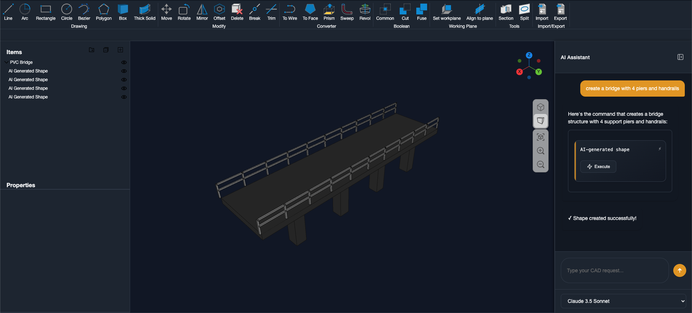

# LuminiCAD


A web-based CAD editor that lets you create CAD models from text descriptions.

[](https://www.gnu.org/licenses/agpl-3.0)
[](https://www.typescriptlang.org/)
[](https://webassembly.org/)

## What is this?

This is a CAD editor is built on Chili3D with AI-powered text-to-CAD capabilities and a scripting interface. You can type something like "make a box with a hole" and it'll try to create that for you. It's a web-based CAD tool for anyone who needs to create CAD models.

## Demo

Watch the AI generate a wavy vase from text description:


## Getting Started

### What you need

-   Node.js 18+
-   npm
-   Git
-   Python 3.8+ (for the CadQuery service - optional)

### Quick setup

```bash
git clone https://github.com/rasenga223/luminicad.git
cd luminicad
npm install
npm run setup:wasm  # This takes a while the first time
npm run dev
```

The app should open in your browser at `http://localhost:8080`.

## Features



### AI Text-to-CAD

You can chat with the AI to generate models. It's not perfect yet, but it works for basic shapes.

**Try these:**

-   "make a box 10x5x2 inches"
-   "create a cylinder with a hole"
-   "add a sphere on top of this cube"

**AI models supported:**
Whatever OpenRouter.ai supports

### CAD Features

**Basic modeling:**

-   Create boxes, cylinders, spheres
-   Boolean operations (cut, union, intersect)
-   Chamfer, fillet
-   Move, rotate, scale objects
-   Snapping and alignment tools
-   Etc

**CAD tools:**

-   Parametric shapes
-   Basic material properties

### Scripting

For complex shapes that the AI can't handle, you can write scripts using our custom DSL:

```dsl
CREATE BOX ORIGIN 0 0 0 SIZE 100 50 HEIGHT 75
CREATE CIRCLE CENTER 50 25 0 RADIUS 20 NORMAL 0 0 1
```

The DSL provides commands for creating basic shapes, boolean operations, extrusions, and more. It's designed to be simple and readable while giving you precise control over the geometry.

### File Support

**Can import:**

-   STEP files (.step, .stp)
-   IGES files (.iges, .igs)
-   BREP files (.brep)

**Can export:**

-   STEP files (.step)
-   IGES files (.iges)
-   BREP files (.brep)

## Development

### Building from source

If you want to work on the code:

```bash
# Build the WebAssembly parts (this takes a while)
npm run build:wasm

# Build the frontend
npm run build

# Or just run in development mode
npm run dev
```

### Testing

```bash
# Run tests
npm test

# With coverage
npm run testc
```

### Environment setup

For the AI features to work, you need to set up:

-   OpenRouter.ai API key (for AI chat)

**Note:** OpenRouter API calls are currently made client-side by default. For better security and to avoid exposing your API key to users, you can deploy the API proxy in the `api/` directory to make calls server-side. See [api/README.md](api/README.md) for deployment instructions.

Create a `.env.local` file:

```bash
VITE_SUPABASE_URL=https://your-project-ref.supabase.co
VITE_SUPABASE_ANON_KEY=your-supabase-anon-key-her
VITE_SUPABASE_PROJECT_REF=your-project-ref
```

For the AI text-to-CAD to work, you have several options:

**Option 1: Deploy CadQuery service (recommended)**

-   Deploy the Python CadQuery service yourself on Google Cloud Run
-   LLMs are familiar with Python and CadQuery scripting
-   Provides a more reliable AI generated geometry

**Option 2: Use one of the built-in AI execution methods (fallback)**

-   **DSL**: AI generates custom DSL commands that get executed directly
-   **JSON**: AI generates JSON scene descriptions that get imported
-   **JavaScript/TypeScript**: AI generates JS/TS code that runs in the browser

**Recommendation**: Start with CadQuery deployment for the best AI results. The built-in methods work as fallbacks and are easier to edit after generation, but CadQuery with Python produces more reliable geometry due to LLMs' strong familiarity with Python scripting.

## What's next

**Current (v0.2.1):**

-   Basic CAD modeling
-   AI text-to-CAD (experimental)
-   File import/export
-   Scripting using DSL
-   Local storage
-   Supabase integration

## License

AGPL-3.0. See the LICENSE file for details.

## Thanks to

-   **Chili3D** - The web-based CAD editor this is built upon ([GitHub](https://github.com/xiangechen/chili3d))
-   **OpenCascade**
-   **Three.js**
-   **CadQuery** - ([GitHub](https://github.com/CadQuery/cadquery))
-   **OpenRouter.ai** - https://openrouter.ai

## Issues and docs

-   Bug reports: [GitHub Issues](https://github.com/rasenga223/luminicad/issues)
-   Questions: [GitHub Discussions](https://github.com/rasenga223/luminicad/discussions)
-   Documentation: [LuminiCAD Docs](https://docs.luminicad.com)

---

> **🚧 Early Development:** LuminiCAD is in its early stages of development! This means we're actively building and improving things, but it also means you might encounter some rough edges. While you're welcome to explore and experiment, we wouldn't recommend using it for any serious projects just yet.
